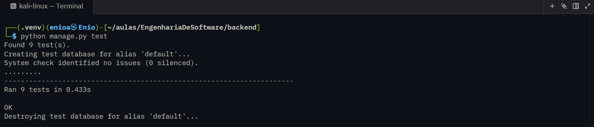

## Classe UsuarioTests:

Testes gerais para todos os modelos.

* **test\_exercicio\_model**  
Testa se a instância de **Exercicio** foi criada corretamente.
* **test\_rotina\_model**  
Testa se a instância de **Rotina** foi criada corretamente.
* **test\_rotina\_exercicio\_model**  
Testa se a instância de **RotinaExercicio** foi criada corretamente.

## Classe RotinaAPITest:

Testes específicos para a classe Rotina.

* **test\_acessar\_rotinas\_sem\_token\_retorna\_401**  
Testa se a API bloqueia o acesso da rota sem o usuário estar logado.
* **test\_acessar\_rotinas\_com\_token\_retorna\_200**  
Testa se a API libera o acesso para o usuário logado.
* **test\_criar\_rotina\_com\_dados\_validos**  
Testa se a criação de uma rotina é feita com sucesso.
* **test\_criar\_rotina\_sem\_nome\_retorna\_erro**  
Testa se a API só cria uma instância com os dados validados.
* **test\_detalhe\_rotina\_com\_sucesso**  
Testa se os detalhes de uma rotina existente são retornados.
* **test\_detalhe\_rotina\_nao\_encontrada**  
Testa se a API retorna um erro se a rotina não existe.

## Print do resultado:

